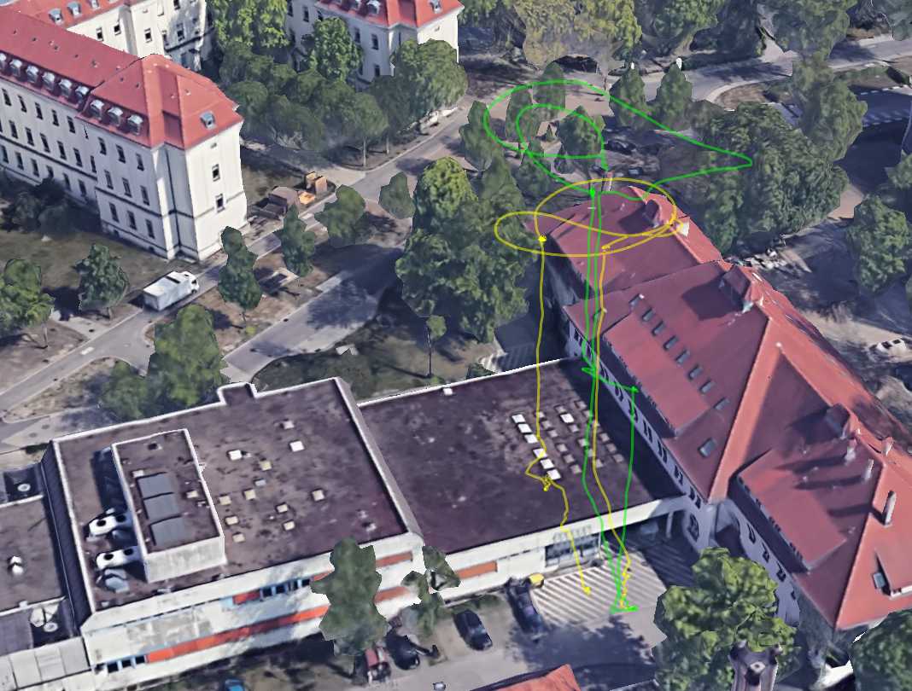

# show ardupilot log in google earth

show the flight path contained in an ardupilot *.bin logfile in the google earth 3d map (kml file)

## install

**requirement:** python3

run:
```
git clone https://github.com/juri117/ardupilot-log-to-google-earth.git
git submodule update --init
```

## use

* in convert.py edit the main function (bottom of the file) to state the files you want to be converted
* a list of files or a single file can be provided, the output will be a single *.kml file combining all input files
* run ```python convert.py```
    * a *.kml file should be generated in the same directory as the convert.py
* visit [google earth](https://earth.google.com/web)
* open the menu on the left
* select *Projects*
* click *Open* -> *Import KML file from computer*


